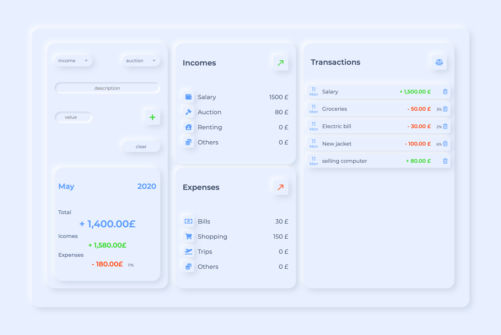

<!-- [![MIT License][license-shield]][license-url] -->

[![LinkedIn][linkedin-shield]][linkedin-url]

<br />
  <h1 align="center">Budgety</h1>

  <p align="center">
    An app to manage your monthly budget
    <br />
    <a href="https://kzkmichal.github.io/Budget-app">View Live</a>
  </p>
</p>

<!-- TABLE OF CONTENTS -->

## Table of Contents

- [About the Project](#about-the-project)
  - [Project Overview](#project-overview)
  - [Screeenshots](#screenshots)
  - [Code Examples](#code-example)
  - [Built With](#built-with)
- [Getting Started](#getting-started)
  - [Installation](#installation)
  - [Available Scripts](#available-scripts)
- [Contact](#contact)

<!-- ABOUT THE PROJECT -->

## About The Project

### Project Overview

<p>
An budget app that helps record montly incomes and epenses.

Whole design was created by me in Figma.

To create this project I've used following JS and ES6 features:

</p>

- Classes
- Arrow Functions
- inport/export
- Functional programming
- Math operations
- Array and Object Methotds
- Local Storage usage
- DOM manipulation
- Rest, spread operators
- Destructurring

### Screenshots

<p align="center">
    
</p>

### Code Example

```sh
export const init = () => {
    UI.displayMonth()
    UI.changedType()
    UI.displayBudget({
        budget: 0,
        totalInc: 0,
        totalExp: 0,
        percentage: -1
    });
    setupEventListeners();
    uploadLocalStorage()
    update()

}
init();
```

```sh
export const displayBudget = function(obj) {
    let type;
    obj.budget > 0 ? type = 'inc' : type = 'exp';
    document.querySelector(budgetLabel).textContent = formatNumber(obj.budget, type) + '£';
    document.querySelector(incomeLabel).textContent = formatNumber(obj.totalInc, 'inc') + '£';
    document.querySelector(expensesLabel).textContent = formatNumber(obj.totalExp, 'exp') + '£';

    if (obj.percentage > 0) {
        document.querySelector(percentageLabel).textContent = obj.percentage + '%';
    } else {
        document.querySelector(percentageLabel).textContent = '';
    }
}
```

```sh
.budget {
    display: flex;
    flex-direction: column;
    justify-content: space-around;
    box-sizing: border-box;
    width: 30rem;
    height: 30rem;
    padding: 1rem 2rem;
    @include boxShadow(2rem);
    @include respond(mobile-small) {
        width: 32rem;
        height: 32rem;
    }
    @include respond(mobile) {
        width: 28rem;
        height: 28rem;
        padding: 1rem;
        margin: 2rem;
    }
```

### Built With

- SASS
- Webpack 4
- JS (ES6)
- Figma

<!-- GETTING STARTED -->

## Getting Started

### Installation

1. Clone the repo

```sh
git clone https://github.com/kzkmichal/Budget-app.git
```

2. Install NPM packages

```sh
npm install
```

### Available scripts

| Command         | Description            |
| --------------- | ---------------------- |
| `npm run dev`   | Open local server      |
| `npm run build` | Create optimized build |

<!-- CONTACT -->

## Contact

Email [kozakmichal48@gmail.com](mailto:kozakmichal48@gmail.com)

Project Link: [https://github.com/kzkmichal/Budget-app](https://github.com/kzkmichal/Budget-app)

<!-- MARKDOWN LINKS & IMAGES -->
<!-- [license-shield]: https://img.shields.io/github/license/othneildrew/Best-README-Template.svg?style=flat-square
[license-url]: https://github.com/othneildrew/Best-README-Template/blob/master/LICENSE.txt -->

[linkedin-shield]: https://img.shields.io/badge/-LinkedIn-black.svg?style=flat-square&logo=linkedin&colorB=555
[linkedin-url]: https://www.linkedin.com/in/michal-kozak-7a881013b/
